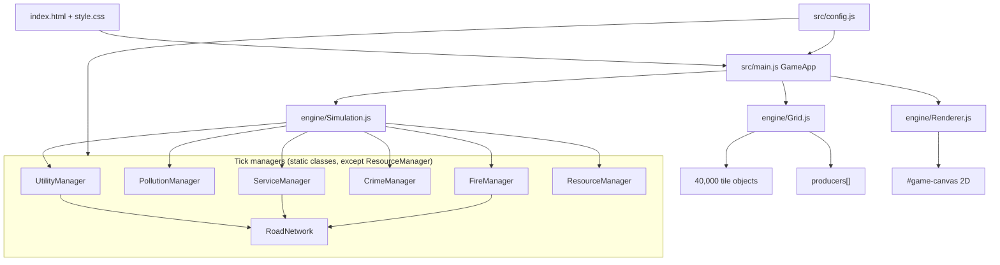
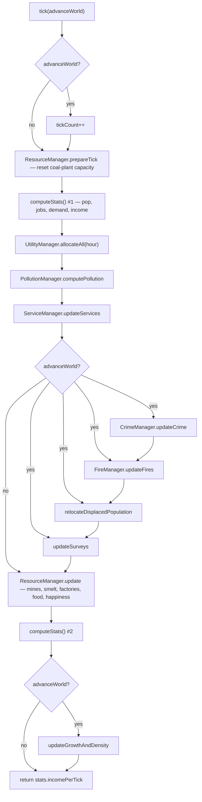
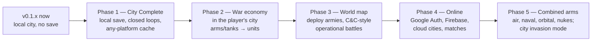

# Build & Conquer 2000 — Project Design Document

| Field | Value |
| --- | --- |
| Title | Build & Conquer 2000 (B&C2000) — Architecture & Product Design |
| Author | TBD |
| Date | 2026-09-25 |
| Status | Living draft (rev 8) |
| Version covered | `APP_VERSION` `0.1.21` (`src/version.js`); current working tree |
| Intended in-repo path | `docs/DESIGN.md` |
| Repo | `g:\Repos\rts-web-game` (`origin`: `https://github.com/Havoc302/rts-web-game.git`) |
| Working tree at inventory | Documentation is checked against the current implementation; uncommitted changes may exist. |

This is a **living** architecture + product document. It records the current implementation, the outstanding Phase 1 work, and the end-state product decisions: a hybrid of SimCity 2000, Command & Conquer, and a RimWorld-style world map, with Google identity and Firebase as the eventual online stack. Phase 1 remains a local city-builder slice. Full combined arms, world-map conquest, multiplayer, and Firebase are a **multi-year** roadmap, not the next two months of PRs.

---

## Overview

Build & Conquer 2000 is a browser city-builder written in vanilla ES modules and Canvas 2D. The player zones a seeded 200×200 map, connects power/water/sewage over a road graph, funds civic services, and runs a tick-based economy of tax, labor, pollution, crime, fire, food, and industry. The current public surface is a **playable SimCity-style loop** with no persistence of city state, no units, no opponents, and no victory condition.

The **product** is a hybrid of **SimCity 2000** (the city), **Command & Conquer** (the army fighting across a map), and a **RimWorld-style world map** (the strategic layer). The city acts like a real city: it provides the **money, industrial base, and people to supply its army**. That army is then used **across the world map** to conquer enemies. Online matches use **Google login and Google Firebase**. Two City Halls on one 200×200 city grid is **not** the end-state.

**Next engineering milestone is still city-complete (Phase 1):** local save/load, closed resource loops, tick hygiene, any-platform rendering. No login, no Firebase, no world map, no combat in that slice. The city *is* the economic engine for later war. Everything after that is a multi-year roadmap, sliced into PRs — not one “build C&C + Firebase + nukes” change.

---

## Background & Motivation

### Why this document exists

The repo grew from an initial city-sim into a multi-manager simulation. `AI-task-list.txt` remains the chronological AI handoff log, while this document is the architecture and product source of truth. The work log is intentionally operational: agents record intended work before generation and completed work plus validation afterward so interrupted tasks can resume.

This document exists to make the following boundaries explicit:

- New systems land by extending `Simulation.tick()` and `src/config.js`, with no stated module boundary for combat.
- Dead or transitional content (`PRODUCER_TYPE.POWER_PLANT`, military stockpiles, and future combat fields) is distinguishable from active Phase 1 behavior.
- Versioning is single-source through `src/version.js`, with `package.json` synchronization tested.
- Anyone joining the project could not tell city-only vs hybrid conquest (this document now records the hybrid).

### Current state (honest)

B&C2000 is a **single-player, client-only, paused-by-default city builder**. A session is: pick a seed → paint roads/zones/producers → unpause → watch the tick. Resetting the map or refreshing the tab **destroys the city** because persistence is still outstanding. Food, consumer goods, oil/fuel, agriculture, crime, fire, services, and military stockpile display are implemented; military production has no unit sink yet.

### Pain points

1. **Standalone JSON save/load is sparse and seed-regenerated.** Saving is available only while paused and importing restores the game paused. `SAVE_VERSION` 2 stores seed, dimensions, biome, and `GENERATION_VERSION`, then sparse tile overrides and producers. Version 1 full-tile files still load through an explicit migration. A generation-version mismatch is refused rather than rebuilding the wrong map.
2. **`Simulation.tick` remains a large orchestrator.** Its pause/preview semantics are now explicit and tested, but named stage extraction is still outstanding.
3. **Military production has no unit sink.** Arms and tanks are visible stockpiles, but barracks, vehicle depots, units, and world-map deployment are later phases.
4. **Emergency coverage now uses cached direct/road/road-side sets.** Survey work remains incomplete.
5. **Survey work is incomplete.** The survey overlay, per-tick cost deduction, cancellation rules, and treasury integration remain outstanding.
6. **Canvas 2D on a 200×200 / 32px map** uses active tile registries, pollution dirty gating, cached stats aggregates, chunked terrain, and bounded HUD/inspector updates. A reporting-phone run at 1x, 2x, and 5x confirmed the city stays responsive after those stages.
7. **UI and renderer behavior has limited automated coverage.** HUD snapshots, inspector signatures, and terrain-chunk invalidation now have Node tests; browser interaction and visual behavior remain mostly manual checks.

---

## Goals & Non-Goals

### Product goals (decided)

- **Hybrid fantasy:** SimCity 2000 city + Command & Conquer conquest + RimWorld-style world map. The city supplies **money, industry, and people**; the army fights **across the world map**.
- **Two map scales:** the existing **200×200 city grid** (tactical/city layer) and a new **world map** (strategic layer: regions/settlements). The city map is one faction’s city, not a dual-City-Hall battlefield.
- **Online:** Google identity + Firebase for accounts, cloud cities, and later matches. Local saves remain the Phase 1 and fallback/dev path.
- **Victory:** complete destruction of an enemy civilisation (invasion, late-game nukes, or orbital bombardment) **or** destroy all military assets and **capture City Hall** — capture takes **quite some time** so the defender can intercept. Sandbox remains a mode, not the victory design.
- **Full combined arms** as the roster destination (multiple infantry, light tanks, MBTs, artillery, missiles, ships, helicopters, planes, satellites, orbital weapons, tactical and strategic nukes), **phased** so the first combat slice is infantry + tanks only.
- **Any-platform:** easier on a large screen, **must be playable on mobile**. Chunked terrain cache is required before city-complete is “shipped.”
- **Google Fonts + system fallback.** The game is online; no self-hosting required.

### Phase 1 goals (next, local)

- Keep a **playable city-builder** on the 200×200 grid with the current stack (`npx serve .`, vanilla ES modules, Canvas 2D, Node assert tests).
- Treat `src/config.js` as the **balance source of truth**.
- **Persist cities** as versioned JSON (localStorage autosave + file export/import).
- **Close civilian resource loops** so food, goods, coal, oil/fuel, and bars have producers and sinks. Arms/tanks stay stockpiled and **visible**.
- **Decompose the tick** into named stages (extract-method).
- Procedural canvas art through city-complete; sprites optional later.

### Current Phase 1 status

Implemented and covered by the current test runner:

- Pause-safe placement previews, treasury accounting, famine recovery, agriculture occupancy, resource consumption, fuel/refining, crime, fire, civic staffing, mobile input/layout, wind/solar/battery connectivity, version synchronization, chunked terrain rendering, and bounded HUD/inspector updates.
- Unified test execution through `npm test`; the current baseline is 29 passing test files.

### Simulation performance

`Grid` maintains active registries for zones, roads, fire candidates, active fires, and repairing tiles. Simulation, utility allocation, services, road-network zone discovery, resources, crime, fire processing, relocation, and road maintenance use those registries instead of repeatedly scanning all 40,000 tiles. Save import rebuilds the registries from restored tile state.

A timed 200×200 50-tick soak, before the later cache stages, spent about 9.04 ms/tick on the measurement machine. The slowest stages were `computeStats` (stats-before + stats-after, ~4.58 ms, more than half of tick time) and pollution (~3.36 ms). Utilities and fire were ~0.46 ms each; remaining stages were ≤0.10 ms.

Caching rules now in force:

- **Services.** `ServiceManager.updateServices()` skips coverage/assignment unless service buildings, road topology, staffing, operational state, or service budgets changed. Staffing and running costs still update when population or workforce changes.
- **Pollution.** After utility allocation, a dirty/state-signature gate recomputes only prior affected tiles plus current source radii. `Grid.pollutionSum` / `Grid.pollutionMax` refresh during that recompute and during `rebuildActiveTileSets()`. Stable ticks reuse the last pollution field.
- **Stats.** `computeStats()` reads those pollution aggregates plus `activeZonedTiles` / `activeRoadTiles` instead of scanning all 40,000 tiles. Placement, bulldoze, fire, density changes, and save import keep the same totals as a full scan.
- **HUD / inspector.** `UiRefresh` snapshots skip unchanged DOM fields. Coarse-pointer mobile layouts also bound HUD/inspector refreshes to `RENDERER_CONFIG.HUD_MOBILE_CADENCE_MS` (500 ms). User actions force an immediate refresh. Simulation ticks always run first.
- **Terrain cache.** 64×64 offscreen chunks, viewport blit only. `Grid.markTerrainChanged()` rebuilds dirty chunks once per frame. Overlay mode paints visible tiles only and does not invalidate chunks. Map regen and save import rebuild the full cache.

`?debugTiming=1` enables `Simulation.enableTiming` and `Renderer.enableTiming` and logs averages every 120 frames. A reporting-phone run at 1x, 2x, and 5x confirmed the city stays responsive after these stages.

### Mobile Performance Plan

Do not make another broad performance refactor without timing evidence. The staged pass is complete:

1. Cache service assignment/coverage work when its inputs are unchanged.
2. Track polluted and water-polluted tiles so pollution recalculation clears and recomputes only affected areas.
3. Incrementally maintain stable-map aggregates rather than rescanning the full grid twice per tick.
4. Measure and bound browser render, HUD, and inspector work separately from simulation.

Inspector regressions found during that pass are also closed: utility producers show their actual connected/serviced state, and producer load/capacity values use two decimal places.

Correctness remains the constraint: river direction, utility shortfalls, fire repair/destruction, population growth, save import, and HUD totals must remain equivalent after every optimization. The staged implementation checklist and validation commands live in `AI-task-list.txt`.

Outstanding implementation work:

- Browser-level validation of JSON save download/import.
- Stacked education tax bonuses from School capacity (staffed Schools only) and University capacity. Ratios: 15% school demand and 5% university demand; full coverage gives +15% and +20% tax yield respectively, with linear partial coverage. Libraries are decoupled from student capacity and growth scores (`LIBRARY_DESIRABILITY_BONUS: 0`), contributing exclusively to public happiness.
- Named tick-stage extraction (`stagePrepare` / `stageUtilities` / …).
- Survey overlay, survey cost/cancellation, and treasury integration.
- Stronger browser-level UI/touch validation.
- Military unit production and world-map systems remain later phases, not Phase 1 blockers.

### Phase 1 non-goals (not product non-goals)

- **No Google login, no Firebase, no match clock** in Phase 1. Those are later phases.
- **No world map, no C&C combat, no nukes/orbital** in Phase 1.
- **No React / bundler / TypeScript / engine rewrite** as a prerequisite.
- **No Starcraft-style free-moving RTS micro** on the city grid.
- **No rewrite of the road BFS** as a condition of later combat.
- **Do not treat `AI-task-list.txt` as current or complete.**
- **Do not put two City Halls on one 200×200 city grid.** Each city is one faction’s grid; armies meet on the world map. Invasion of a city grid is a later mode.

---

## Current Architecture

### Runtime topology

Entry is `index.html` → `src/main.js` (`GameApp`) → `Grid` + `Simulation` + `Renderer`. There is no bundler. Tests are Node ESM scripts using `assert`.



`GameApp` owns **treasury**, **active tool**, **input**, and the **sim interval**. `Simulation` owns tick count, tax rate, pension budget, stats, and `ResourceManager`. There is **one** cash pile, **one** stockpile, **one** stats struct. This split matters for save/load *and* is why dual-city Conquer is not a filter.

### Stack and numbers

| Item | Value | Source |
| --- | --- | --- |
| Map | 200×200 tiles (40,000) | `MAP_WIDTH` / `MAP_HEIGHT` |
| Tile size | 32 px → 6400×6400 world pixels | `TILE_SIZE` |
| Money scale | Pre-scaled monetary constants; no runtime multiplier | `src/config.js` |
| Starting treasury | `$25,000` (`2500 * 10`) | `STARTING_TREASURY`; HUD seed text in `index.html` |
| Tick wall-clock | `2000 / speed` ms (`1x=2s`, `2x=1s`, `5x=400ms`) | `GameApp.setSpeed` |
| Clock | 1 tick = 1 in-game hour, 24-hour day, day 06:00–18:00 | `TICKS_PER_HOUR`, `DAY_START_HOUR`, `NIGHT_START_HOUR` |
| Zoom | 0.4–2.5, default 1.0; low-detail below 0.7 | `RENDERER_CONFIG` |
| Terrain cache budget | 1,200 tiles/frame while building | `RENDERER_CONFIG.TERRAIN_BUILD_BUDGET` |
| Terrain chunk size | 64 tiles (2048 px, under a 4096 GPU cap) | `RENDERER_CONFIG.TERRAIN_CHUNK_TILES` |
| Mobile HUD cadence | 500 ms on coarse-pointer layouts | `RENDERER_CONFIG.HUD_MOBILE_CADENCE_MS` |
| Dev | `"dev": "npx serve ."` | `package.json` |
| Version | `0.1.6` from `src/version.js`, synchronized with `package.json` and cache-busting consumers | `tests/version-sync.test.js` |
| `config.js` | 690 lines total (~637 non-blank) | file |
| `Renderer.js` | 897 lines | file |

### Tick pipeline (the heartbeat)

`Simulation.tick(advanceWorld = true)` in `src/engine/Simulation.js`:



`GameApp.simTick()` (interval, only while unpaused) applies treasury:

```text
treasury += incomePerTick - serviceExpenses - roadExpenses
```

Placement success (`handleCanvasClick`) currently:

```js
this.treasury -= cost;                                    // construction purchase — keep
const income = this.simulation.tick(!this.simulation.isPaused);
this.treasury += income;                                  // bug: extra income, no expenses
```

While paused, `advanceWorld` is false, so crime/fire/surveys/growth/`tickCount` freeze — but `ResourceManager.update` **still runs**, so placing a tile while paused can extract ore, smelt, grow food, and apply famine `populationLoss`. That is a current correctness bug.

**Intended pause/treasury semantics (Phase 1, decided):**

- **`simTick()` is the only path that mutates treasury for income and expenses.** Construction still does `treasury -= cost` on successful place (a purchase, not a sim tick).
- Placement always calls `tick(false)` to refresh utilities/HUD. It never calls `tick(true)`, never does `treasury += income`, and never subtracts service/road expenses.
- **`tick(false)` is a preview:** it must not persist wind `capacity` or battery `storedEnergy`. `allocateAll` runs in preview mode (see Key Decision 13): recompute `usedCapacity` and HUD demand from the last advancing tick’s persisted generation/storage; do **not** call `updatePowerGeneration` (no wind reroll), `settleBatteries`, or `chargeBatteries`. Do **not** run `prepareTick` on the paused path (that write sets `coal_plant.capacity = coalCapacity` and would un-starve a fuel-empty plant).
- Gate `ResourceManager.update` and `populationLoss` on `advanceWorld`.
- Do **not** “align” placement with `simTick` expenses: that would charge a full economic tick per painted road tile.

### Map and terrain (`Grid`)

`Grid` (`src/engine/Grid.js`) is the spatial source of truth.

- **PRNG.** `createPRNG(seed)` is a Mulberry32-style generator. It falls back to `TERRAIN_GENERATION_CONFIG.DEFAULT_RANDOM_SEED`, which **is not defined** in `config.js`. `parseInt(undefined, 10)` is `NaN`; `NaN || undefined` is `undefined`; `undefined ^ 0x6d2b79f5` ToInt32-coerces to `0` then XOR. Invalid seeds therefore all share the **same** stream (seed 0 XOR constant), they do not “hash `undefined`.”
- **Seeded vs unseeded RNG today:**
  - Seeded (`this.random` / `createPRNG`): terrain, rivers, lakes, forests, rocks, hidden ores; crime **tile sampling** (`CrimeManager.sampleRandom(..., grid.random)`).
  - Unseeded (`Math.random`): wind capacity swing, fire ignition and spread, crime event roll and police suppression, the initial random seed pick in `getInitialSeed`.
- **Seed sources, in order:** `?seed=` URL param → `localStorage.bc2000_map_seed` with one-time legacy read of `metropolis_map_seed` → random in `[100000, 9100000)`. Reset/regen writes the current key and URL.
- **Generation order** (`generateProceduralTerrain`): rivers (simple 40% / fork 30% / merge 30%) → 0–5 lakes → forest clusters scaled by map area → rock/mountain clusters. Rivers store `riverFlowDir` for pollution and water animation. River *generation* uses `this.random`, not `Math.random`.
- **Hidden ores.** `generateHiddenOres` rolls `ORE_GENERATION` per terrain (mountain 35%, flat 3%, forest 1.5%, water 1%) and picks uniformly from iron / bauxite / coal / oil.
- **Tile schema** (`createDefaultTile`): terrain, road/bridge/tunnel flags, zone, density, growthScore, industrial `recipe`, population bookkeeping (`relocatedPopulation`, `fireDisplacedPopulation`, `populationLoss`), producer pointer, utility shortfall/distances, pollution, ore/survey fields, crime, fire, `destroyed`. No `ownerId`. No visibility field.
- **Placement rules.**
  - Roads: flat, not destroyed, no road/zone/producer.
  - Bridges: water tiles; set `hasRoad` + `hasBridge`.
  - Tunnels: mountain tiles; set `hasRoad` + `hasTunnel`. Cost `$1,000`.
  - Zones: flat, road-adjacent, empty. Residential/commercial `$200`; industrial/agricultural `$300`.
  - Producers: water-adjacent where required (nuclear, water pump, sewage); ore-match for mines/derrick (mines allowed on non-water terrain, including mountains); unique City Hall; windmill/solar require an 8-neighbor battery **at placement**.
  - Survey: one idle operational road-adjacent Survey Station, 10 ticks standard / 20 mountain. An exposed mountain is surveyable normally; a mountain with all four orthogonal neighbors also mountainous requires an adjacent tunnel for access.
  - Bulldoze `$50`: clears zone/road/bridge/tunnel/producer, converts forest to flat (bumps `terrainVersion`), and can un-destroy a burnt tile.

### Camera and input (`GameApp` + `Renderer`)

- **Desktop camera pan is right-drag.** Touch: single-finger drag always pans (never drag-builds). The Pan tool does **not** left-drag the camera; its left-click/drag selects tiles (same path as Inspect).
- **Desktop left-drag** calls `handleCanvasClick` on every move for **any tool except Inspect**, including producers — not only “repeatable” tools. Inspect is click-to-select only (no paint-drag).
- **Zoom.** Wheel, cursor-centered (`RENDERER_CONFIG.ZOOM_MIN/MAX`).
- **Touch tap-to-build** after `< 8px` movement.
- **Mobile.** `matchMedia('(max-width: 820px) and (hover: none) and (pointer: coarse)')`. Off-canvas tool/HUD drawers, safe-area offsets, auto-switch to Pan after placing a `producer_*` only.
- **Renderer.** Viewport culling; 64×64 offscreen terrain chunks with viewport blit; dirty-tile incremental rebuilds via `Grid.markTerrainChanged()`; overlays paint visible tiles only and do not invalidate chunks. Night tint `NIGHT_TINT_ALPHA = 0.35`; low-detail path under zoom 0.7 (and 33 ms throttle). Overlay picker: power, water, sewage, pollution, crime, survey, police, fire, hospital.

Art is 100% procedural canvas (houses, fields, spinning windmill blades, battery fill, river chevrons, fire flicker). Mines, warehouses, smelter, silo, oil derrick fall through to a generic colored rect + 5-letter label in `renderProducerTile`.

### Zoning, growth, labor, tax

**Zones** (`ZONE`): residential, commercial, industrial, agricultural. Densities light → medium at growth 10, medium → high at 25, cap 50 (`GROWTH_CONFIG`). Density never downgrades.

**Residential population** (`computeTilePopulation`): linear in growth score within the current density band, capacity `25 / 125 / 500`. No free population at growth 0.

**Demographics** (`DEMOGRAPHICS_CONFIG`, Australia-inspired): school-age 16%, retirees 17%, workforce 52%. `splitDemographics` is a static split of current population — there is no aging sim.

**Jobs.** Commercial/industrial/agricultural job slots come from `jobsProvidedFor`: workforce share of residential capacity, split 40/40/20 C/I/A, normalized to the largest share.

| Density | R cap | C jobs | I jobs | A jobs |
| --- | --- | --- | --- | --- |
| Light | 25 | 13 | 13 | 7 |
| Medium | 125 | 65 | 65 | 33 |
| High | 500 | 260 | 260 | 130 |

City-wide `employmentRate = jobsFilled / totalJobsProvided` (a **vacancy-fill ratio**, not resident unemployment). Filled jobs on C/I/A tiles are `round(totalJobs * employmentRate)`. High tax above 50% shrinks job slots by up to 50% (`MAX_HIGH_TAX_JOBS_REDUCTION`).

**Tax.** Slider 0–100% (`LABOR_TAX_GROWTH_CONFIG`). Revenue:

```text
income = ((population/100) + (jobsFilled/100)) * $10 * (taxRate/100) - crimeTaxLoss
```

`BASE_INCOME` still exists and is tested by `industrial-economics.test.js`, but **`computeStats` does not use it**. **Decision: delete `BASE_INCOME`** and retarget that test at the live tax formula (industrial tiles still yield more than commercial at equal fill because they provide the same jobs table — assert the live `incomePerTick` relationship, or drop the I>C income assertion if it no longer holds). Growth modifier is continuous: bonus below 40%, negative at 50%, quadratic outflow toward 100%. Residential growth **stalls** (`delta = 0`) if any workers are unemployed or if the city has zero workplaces.

**Treasury** lives on `GameApp`, not `Simulation`. Road maintenance is `$1` per road/bridge/tunnel tile per tick (`ROAD_MAINTENANCE_COST = 1`). Monetary values are pre-scaled constants. Pensions are folded into `serviceExpenses`.

### Utilities and day/night

`UtilityManager.allocateAll` (`src/engine/UtilityManager.js`):

1. `updatePowerGeneration(hour)` — wind ±25 around 40 (min 10) and solar's 06:00–18:00 bell curve are passive generation; battery discharge is capped at `min(40, storedEnergy)`.
2. Allocate live renewable power through each adjacent road-connected battery nearest-first, with no battery discharge-bandwidth cap on this pass; then allocate battery storage only to remaining demand, then dispatchable power plants for any remaining deficit.
3. `settleBatteries`, then charge each adjacent road-connected battery from unused wind/solar output; charge batteries from unused dispatchable generation afterward. A battery never charges and discharges in the same tick.
4. Allocate **water** nearest-first; **sewage** farthest-first (`descending`) so distant tiles back up first.
5. `allocateUtilityConsumers` — every producer with `utilityUsage` draws from the nearest road-connected source. 5-tick grace (`UTILITY_FAILURE_GRACE_TICKS`) before `operational = false`. Generation capacity itself is **not** gated on `operational` (intentional, to avoid cascade blackouts).

Zone utility demand is `USAGE_RATES[zone][density] * occupancyRatio`. Occupancy is implemented for residential, commercial, industrial, and agricultural tiles. Empty capacity contributes no demand; filled agricultural jobs contribute utility demand according to the agricultural usage table.

Windmills and Solar Panels are passive generators. They require an adjacent Battery Storage tile at placement and that battery must be road-connected to contribute to the grid; neither the renewable nor the battery's own utility status gates renewable generation. Connected renewable output passes through the battery to live grid demand without the battery's stored-energy discharge cap; the cap applies only when stored energy covers a deficit. Renewables produce no direct utility demand, staffing, water, or sewage usage. The Tile Inspector reports this as a battery-mediated connection rather than a missing local road.

Leftover **generic `power_plant`**: still in `PRODUCER_TYPE` / `PRODUCER_CONFIG` / renderer art / tests (`simulation.test.js` Test 1). Removed from the toolbar. Capacity 100, cost `$5,000`. Tests use it as a stand-in. **Decision: quarantine as test scaffolding** (helper that places coal/nuclear/wind, or a `TEST_ONLY` export). Do not restore it to the toolbar.

### Pollution

`PollutionManager.computePollution` sources, in order:

1. Industrial Manhattan falloff (`INDUSTRIAL_RADIUS` 3/5/7, emission 2/5/10).
2. Sewage-backup emission on shortfall tiles (radius 4, emission 6).
3. Coal plant smokestack (`COAL_CONFIG` radius 6, emission 12).
4. River discharge: sewage `usedCapacity` injected into adjacent water, BFS downstream using `riverFlowDir` and `RIVER_FLOW_DOWNSTREAM_THRESHOLD = 0.5`, falloff 10/tile. Contaminated water pumps (`WATER_TOWER`) spread radius 8 / emission 15.
5. Forest absorption `FOREST_POLLUTION_ABSORPTION = 6`.

Industrial zones are immune to the pollution growth penalty; R/C (and A, because they are not industrial) take `-1` at pollution ≥ 5. Forest within Manhattan 3 grants +1 residential growth.

### Civic services, crime, fire, medical

`ServiceManager.updateServices` staffs police, fire, hospital, school, library, city hall **before** the remaining workforce is left for C/I/A (comment: “Fully funded essential services receive workers before commercial and industrial jobs”). Police/fire/hospital scale with population (min 2 staff, 1 per 1,000 residents, capped by density job table). Coverage radius scales with budget × staffing. Running cost is per filled job × utility demand factor × budget.

`ServiceManager` owns civic/service staffing, while `ResourceManager.updateProducerJobs` is restricted to configured resource/factory categories. Full simulation tests should continue to protect this ownership boundary.

Resource/factory producers are explicitly categorized for staffing. Utility producers without jobs do not enter the staffing pass. Tests that exercise staffing should call full `simulation.tick()` where ownership interactions matter.

Crime (`CrimeManager`): decay 1/tick; spawn chance `0.05 + jobScarcity * 2.5` on a sample of up to 15 **R/C/I** tiles (agriculture excluded); 85% police suppression; +2 per event, cap 10; diffusion to unpoliced R/C/I neighbors above 4. Tax loss 5% per crime point, cap 50%. Growth penalty −2 at crime ≥ 3.

Fire (`FireManager`): agricultural occupancy participates in ignition and spread. Forests ignite at 0.001%/tick and spread to each adjacent forest at 1%/tick. Each wildfire has one 0.1% chance, resolved when it begins, to create one injury; it never creates additional injuries while burning. Burning inhabited zones and producers create 5 injuries/tile/tick. Burning homes relocate 50%/tick; +10 damage/tick; destroy at 100 via `grid.bulldoze` + `destroyed`. A burnt-out forest becomes non-flammable and cannot spread further. Suppression from the nearest operational fire station is applied before damage growth. Roads, bridges, tunnels, water, mountains, and uninhabited flat tiles are not flammable.

The realistic fire model is implemented: roads, bridges, tunnels, water, mountains, and uninhabited flat tiles do not burn; forests, producers, and inhabited zones can ignite and receive spread. Firefighter effectiveness remains a later balance pass.

Medical: patients from residents (retirees ×3, more if pensions underfunded), industrial/ag jobs, crime, pollution, fire injuries. Hospital capacity = filled jobs × 15. Untreated patients apply citywide residential growth −2 and a happiness penalty.
- **Hospital:** Costs $6,000, scales across Light/Medium/High tiers (jobs 10/50/200, radius 10/50/200).
- **Clinic:** Costs $2,000, fixed size (does not grow larger; light density only, max 5 jobs), serves up to 5,000 population, radius 10, provides patient capacity (jobs × 15) and full medical service coverage to nearby tiles.

- **Library:** Costs $2,500, running cost $1 per job. Decoupled from education metrics and residential growth deltas (`LIBRARY_DESIRABILITY_BONUS: 0`); coverage feeds strictly into the global public happiness score calculation.
- **School:** Costs $3,500, running cost $2 per job. Generates primary student capacity for school demand (`15%` of population), contributing up to a +15% stacked global tax bonus at 100% fulfillment.
- **University:** Costs $12,000, running cost $8 per job. Generates higher-education capacity for university demand (`5%` of population), contributing up to a +20% stacked global tax bonus at 100% fulfillment.

### Resources, industry, happiness

`ResourceManager` stockpile keys: `food, coal, oil, fuel, ironOre, bauxiteOre, ironBar, bauxiteBar, consumerGoods, arms, tanks`.

| Loop | Producer | Sink | Status |
| --- | --- | --- | --- |
| Food | Agricultural yield 4/20/80 × job fill; industrial `FOOD` recipe | `FOOD_PER_RESIDENT = 0.05`; unfed tiles lose 5% pop/tick | Closed; famine loss clears when food returns |
| Ore → bars | Mines 0.2/job; smelter 1 ore + 0.5 coal → 1 bar, 0.2 bars/job | Industrial `ARMS`/`TANKS` | Partial — bars only needed for unused military recipes |
| Coal | Coal mine | Smelter + coal plant `0.02` per MW used | Closed if you mine it |
| Oil / fuel | Oil derrick → `oil`; refinery → `fuel`; silos store `oil` or `fuel` | Occupied zones and coal plants consume fuel | Implemented; tuning and tests may continue |
| Consumer goods | Industrial `CONSUMER_GOODS` rate 0.2/job, no inputs | Demand `0.08`/resident; stockpile is consumed and contributes to happiness/tax effects | Implemented; tuning and tests may continue |
| Arms / tanks | `ARMS` (0.5 ironBar, rate 0.05); `TANKS` (1 ironBar + 0.5 bauxiteBar, rate 0.02) | No unit sink yet | Stockpiled and visible; war-economy sink is later |
| Storage | Ore/bar/goods warehouses 500 each; silo 500 oil or fuel | Clamp after production | Working |

Famine loss is recalculated per advancing tick and cleared when food demand is met. Preview ticks do not run resource consumption or famine mutation.

Happiness (`HAPPINESS_CONFIG`) is a 0–100 SimCity 2000-style mayor rating. 50 is neutral. It combines tax, employment, utilities, civic coverage, goods ratio, pollution, crime, untreated patients, fire injuries, and food shortfall. Each point above 50 adds `GROWTH_DELTA_PER_POINT` (0.1) to residential growth; each point below 50 subtracts the same. That growth score drives residential occupancy, so an unhappy city loses residents without lowering density. Commercial and industrial growth still follow jobs and tax, not happiness.

### HUD and UI

`index.html` + `style.css`: glass panels, Inter + JetBrains Mono, SVG HUD sprites.

- Top bar: pop, treasury, income, service cost (includes pensions), road cost, jobs available, employment %, happiness, tax slider, tick, and clock. Stockpiles live in the right HUD's Storage tab.
- Right HUD tabs: Utility Demand & Capacity plus demographics, Storage for all stockpiles, and Service Budgets.
- Overlay picker: Normal, Power, Water, Sewage, Pollution, Crime, Police, Fire, Hospital.
- Utility HUD: demand/capacity meters, hospital patients, pollution avg/max, demographics, service + pension budget sliders.
- Tool drawer groups: General, Transport, Zoning, Utility Producers, Production, Civic, Exploration.
- Build-info panel for `producer_*` and R/C/I/A zones.
- Tile inspector: terrain, road/bridge, zone, density, pop/jobs, demographics, industrial recipe select, silo storage select, growth, pollution, crime, fire, ore, utilities, producer load. Inspector DOM work skips when the selected-tile signature is unchanged; mobile layouts share the HUD cadence bound.
- HUD text/meters apply only dirty fields from `buildHudSnapshot()`. User actions force a refresh. Simulation state is never delayed to spare the DOM.
- Mobile drawers and toggles as above.

### Test surface

Node `assert` scripts; `package.json` `"test"` runs `tests/run-all.js`, which discovers and executes every `tests/*.test.js` file. Focused npm scripts remain available for the major feature areas.

| Suite | Covers | Gaps |
| --- | --- | --- |
| `simulation.test.js` | Roads/BFS, wind+battery, fire destroy/relocate/risk, occupancy-scaled utilities, allocation order, growth, tax, pollution, water-adjacent, labor, stall, tax pressure, disconnected producers, map gen | No agriculture in core tests; uses leftover `POWER_PLANT` |
| `ore-survey.test.js` | Ore rates, survey duration, active power | — |
| `river-pollution.test.js` | Idle plant, falloff 10, combined discharge | — |
| `service-buildings.test.js` | Utilities, min staff 2, grace ticks, fire suppression, pop scaling, budget | Full-tick staffing ownership coverage should continue to expand |
| `tax-pressure.test.js` | Happiness at 0% tax; 50%/100% pop and jobs | — |
| `tax-revenue.test.js` | $10/100 residents+jobs × rate | — |
| `road-maintenance.test.js` | $1/tile; tunnels | Cost not 10× scaled |
| `income-population.test.js` | Income tracks pop | — |
| `industrial-economics.test.js` | Zone cost $300; `BASE_INCOME` I > C | Tests a table the sim no longer uses — delete the table |
| `school-cost.test.js` / `service-expense-scale.test.js` | Job-based running costs | — |
| `resource-management.test.js` | Agriculture, mines, smelter, food, goods, fuel, and famine behavior | More end-to-end production-chain assertions are useful |
| `small-town-soak.test.js` | Deterministic 50-tick mixed-zone town, upstream water intake, utility chain, bounded medical demand, and finite stats | Device timing is recorded in `AI-task-list.txt`; phone check at 1x/2x/5x passed |
| `active-tile-registry.test.js` | Registry maintenance, pollution cache vs scan, stable-tick aggregates, bulldoze, save import | — |
| `hud-update.test.js` | HUD snapshots, dirty fields, mobile cadence, ticks still advance | — |
| `renderer-cache.test.js` | Terrain-chunk identity on stable ticks, overlay non-invalidation, incremental bulldoze, full regen | — |
| `demographics.test.js` | 40/40/20 jobs, split, pensions, retiree patients | — |

**Still lightly tested:** `main.js` input and treasury wiring, CSS/HTML, visual HUD behavior, browser touch interaction, and JSON file download/import in a real browser. Sparse-save size and version-1 migration are covered by `tests/save-game.test.js`. Full-map mobile responsiveness was verified on the reporting phone after Stage 5.

---

## Proposed Design

### Product vision (decided)

**Build & Conquer 2000** is a hybrid of SimCity 2000, Command & Conquer, and a RimWorld-style world map. The player builds a city that funds and staffs an army; that army is deployed **across a world map** to conquer enemies. Online matches use Google login and Firebase. This is a **multi-year** product. Phase 1 is still the local city.



### Phase 0 — what is already playable

A player can generate a map, build a powered/watered/sewered city, grow R/C/I/A, fight crime and fire, survey mountains, mine, farm, and go broke on roads and pensions. That is a real Phase 0 game loop. It is **not** city-complete: refresh still loses the city, emergency coverage caching and survey cost/cancellation are unfinished, the tick still needs named-stage extraction, and military stockpiles do not yet produce units.

### Phase 1 — City Complete (next, required, single-faction)

Ship a city-builder you can put down and pick up. Still one treasury on `GameApp`, one `ResourceManager`.

1. **Save / load / new city** — concrete `SaveDocument` below. Autosave on pause + every 24 ticks. Export/Import JSON. New Game confirms destructive reset.
2. **Pause means pause.** `simTick()` is the only income/expense treasury mutation. Placement: `treasury -= cost` then `tick(false)` only. Preview allocation must not persist `storedEnergy` or wind `capacity`. Gate `ResourceManager.update` and famine on `advanceWorld`. Clear `populationLoss` when food shortfall is 0. Do not run `prepareTick` while paused.
3. **Close civilian loops** (Key Decision 12). Decrement `consumerGoods`. Industrial recipe `FUEL`. Road-tile fuel sink. Show oil/fuel/bars/happiness/arms/tanks on HUD.
4. **Agriculture first-class.** Occupancy in `getTileOccupancyRatio` and fire; crime sample; `stats.zones.agricultural`; build-info for `zone_a`.
5. **Staffing ownership.** Tag remaining producers with `category`. `ServiceManager` owns civic jobs; `ResourceManager.updateProducerJobs` only mutates `category === 'resource' | 'factory'`. Fire is not a special case.
6. **HUD honesty.** Happiness, bars, oil, fuel, arms, tanks. Badge fallback = `APP_VERSION`. `package.json` synced. Expose police/fire/hospital overlay buttons the renderer already implements.
7. **Hygiene.** The default seed, current seed key migration, monetary cleanup, agricultural support, and wind/solar connectivity alignment are implemented. Generic `POWER_PLANT` remains test scaffolding. Persisting a simulation RNG for save/load, and fully quarantining the test producer, remain future cleanup.
8. **Tick decomposition** is extract-method only (PR 8), preserving post-PR-4 order. No combat hook in that PR.
9. **Chunked terrain cache is required** before calling city-complete shipped (PR 8b): 64×64 (or ≤2048²) offscreen tiles instead of one 6400² canvas. Any-platform: playable on mobile, easier on a large screen.
10. **Fire spread rules** aligned with realistic flammability (inhabited + forest/mountain burn; roads and barren flat do not). Firefighter effectiveness is a later balance pass.

### Two map scales (decided)

| Layer | What it is | What lives there |
| --- | --- | --- |
| **City grid** | Existing 200×200, 32px tiles, tick sim | Zoning, utilities, industry, barracks, City Hall. **One faction per grid.** |
| **World map** | New RimWorld-style strategic map (regions/settlements) | Army stacks, other players’/AI settlements, movement between regions, operational battles |

The city grid is **not** where two civilisations share one map with two City Halls. When you open a city, you play that faction’s 200×200. Armies **deploy from the city onto the world map**. World-map battles default to **operational resolution on the world map** (option **b**): stacks fight on the strategic layer using the same tick-batch HP rules as Appendix A, not a third “tactical arena” map (option a is rejected for v1). **City-grid invasion** (option **c**) is a **later mode**: when an enemy stack reaches a settlement, the defender’s city grid can become a battlefield and City Hall capture starts a long timer. Do not build invasion in the first world-map PRs.

**Army deploy (design-level):**

- Units produced in the city sit in `grid.units[]` and/or a **garrison pool** (stockpile of formed units at City Hall / a depot).
- A **Deploy** action (city UI) assigns a stack to the world-map token of this settlement, consuming those units from the city grid (they leave the 200×200).
- The world-map stack carries `{ ownerId, composition: { infantry: n, tank: n, … }, fuel, hp aggregate }`.
- Returning to the city (if the stack is at home) re-spawns units onto rally tiles, stalling if `UNIT_STACK_LIMIT` overflow — same as production overflow.
- Fuel for world-map movement comes from the faction’s `fuel` stockpile at deploy time (and optionally a per-region upkeep later).

### Faction economy (one civilisation = one city sim)

Keep the **Faction record** (treasury, stockpile, stats, budgets). Use it as **one economy per city / civilisation**, not two owners on one 200×200.

Today the sim is a singleton economy:

Today the sim is a singleton economy:

| Object | Cardinality | Owner |
| --- | --- | --- |
| `GameApp.treasury` | 1 | player |
| `Simulation.resourceManager.stockpile` | 1 | player |
| `Simulation.stats` | 1 | player |
| `Simulation.taxRate` / `pensionBudget` | 1 | player |
| Producer `budget` | per building | player sliders |
| `UtilityManager.allocateAll` | 1 graph | all producers |
| `RoadNetwork.computeProducerDistances` | 1 BFS | all producers |

Two civilisations cannot share that singleton. Each opponent city (AI or human) gets its **own** `Grid` + `Simulation` + `Faction` (or an **abstracted** economy — Open Question: full-fidelity vs abstract opponents). The player’s Phase 1 city stays a singleton until a second city exists.

**`Faction` record** (lives on that city’s `Simulation`):

```js
{
  id: 'player' | 'ai',
  treasury: number,
  taxRate: number,
  pensionBudget: number,
  serviceBudgets: { police_station: number, /* … */ },
  resourceManager: ResourceManager,   // own stockpile + capacity
  stats: { /* same shape as Simulation.stats today */ },
}
```

`GameApp.treasury` becomes an accessor to the open city’s `faction.treasury`. HUD binds to that city. Interval `simTick` applies that city’s `income - serviceExpenses - roadExpenses`.

On a **single** city grid, `ownerId` is `'player'` (or that civilisation’s id) on all built tiles. Wilderness remains `null`. `CITY_HALL` `unique: true` stays **one hall per city grid** — that is correct under this vision. Do not change uniqueness to “two halls on one map.”

When a second civilisation exists, it is a **second Simulation**, not a second `ownerId` on the same `tiles[]`. The two-faction-on-one-grid tick loop from rev 3 is **withdrawn** as Conquer architecture. If city-invasion mode (later) needs hostile units on the defender’s grid, those units are `grid.units` with `ownerId` of the invader; they do not get their own zoning/utilities on that grid.

**World-map tick (later):** a `WorldSimulation` steps region movement and operational battles at the match clock (Open Question: lockstep vs turns vs server realtime). Each participating city sim may tick on a slower cadence or be abstracted.

**What this is not**

- Not two City Halls on one 200×200.
- Not a second `GameApp` per opponent in Phase 1.
- Not Firebase in Phase 1.

**PR placement:** Phase 1 does **not** include a dual-owner tick. After city-complete: war economy in the **player’s** city, then world-map shell, then deploy, then operational combat. `SAVE_VERSION` stays 1 through Phase 1; a later world-map PR bumps it when `world` / `factions[]` appear on disk.

### Firebase / Google identity (later phase, not Phase 1)

| Role | Service | When |
| --- | --- | --- |
| Auth | Firebase Auth, **Google** provider | First online PR |
| Cloud city / save | Firestore (preferred) or RTDB — `SaveDocument` JSON plus metadata (`uid`, `appVersion`, `savedAt`) | Same phase as Auth; local save remains fallback |
| Match state | Firestore or RTDB room: world-map tokens, clock, outcomes | After world map exists |
| Hosting | Firebase Hosting optional; current `npx serve .` / static host is enough for Phase 1 | Optional |

No Firebase schema dump here. Phase 1 PRs 1–8b stay valid with **zero** Firebase imports. Security for online (cheat-able client sim, auth tokens, save ownership) is designed in the Auth PR, not now.

### Phase 2 — War Economy (player city; after Phase 1)

Make `FACTORY_RECIPES.ARMS` and `TANKS` mean something **before** pathfinding exists. Military production has an explicit economic opportunity cost: private industry can be requisitioned, but it is not free.

#### Military production economics

- Industrial zones default to consumer-goods production and continue to earn their normal tax income.
- Selecting a non-consumer-goods recipe on an industrial tile, including arms or tanks, requisitions that private industrial capacity for the duration of production. While requisitioned, the tile produces no tax income.
- Requisitioned industrial production also charges the faction treasury each advancing tick. This represents the government paying private industry to build military goods. The exact cost is a balance constant and must be defined with the recipe/war-economy implementation; it is not inferred from the lost tax.
- Dedicated military construction buildings are the preferred military-production path. Each dedicated building has an explicit asset type/recipe and produces at **2× the equivalent industrial-zone production rate**, subject to staffing, utilities, inputs, storage, and any queue/rally constraints.
- Dedicated military buildings do not use the industrial-zone tax-replacement rule because they are purpose-built military infrastructure rather than requisitioned private industry. Their construction price, jobs, utilities, running cost, and military production cost are separate balance values.
- The HUD and save state must expose enough information to explain the tradeoff: active recipe, production progress, military-production expense, and the tax income forgone by requisitioned industrial tiles.

**Unit production model (Key Decision 14) — option C, the only model:**

Building **queue + auto-rally onto adjacent empty tiles**. Not click-to-deploy.

- New producers: **Barracks** (infantry; input `arms`) and **Vehicle Depot** (tanks; inputs `tanks` + `fuel`). Both have `category: 'factory'`, utility usage, and jobs. Staffed by `ResourceManager.updateProducerJobs`. These are the first dedicated military construction buildings and use the 2× dedicated-factory rate.
- Each building has `queue: { type, progress, rallyTile | null }`. One unit in progress at a time (no deep queue in v0.3).
- Each advancing tick, if `operational` and inputs available and jobs filled: consume inputs for that tick’s progress; at `progress >= 1` attempt spawn.
- **Spawn adjacency:** 4-neighbors of the building, prefer `rallyTile` if it is adjacent or reachable; else first neighbor in N,E,S,W order that can accept the unit.
- **Source of truth:** `grid.units[]` only. Spatial index `grid.unitsAt(x, y)` / `Map<"x,y", id[]>` maintained on spawn/move/death. Inspector reads the index. **There is no `tile.units` array.**
- **`UNIT_STACK_LIMIT = 4`** (named constant in `config.js`). Mixed types allowed in a stack. A tile “can accept” iff `unitsAt(x,y).length < UNIT_STACK_LIMIT`, terrain is passable for that type, `ownerId` is friendly or wilderness, and the tile is not `destroyed`.
- **Overflow:** if no adjacent tile can accept the unit, **production stalls**: `progress` stays at 1, inputs are **not** consumed that tick, HUD shows “No rally space.” The unit is not deleted and not paid for twice.
- Rally: player (and later AI) may set a rally tile on the producer; spawned units receive a move order to it once movement exists. In Phase 2 (no movement yet) rally only chooses the spawn neighbor closest to that tile; if the rally tile itself is adjacent and has space, spawn there.
- No enemy required. This phase is a resource sink + data model.

**Unit record:**

```js
{
  id,            // grid.nextUnitId++
  ownerId,       // 'player' | 'ai'
  type,          // first slice: 'infantry' | 'tank'; later combined-arms types
  x, y,
  hp, maxHp,
  movePoints,    // filled each tick from COMBAT_CONFIG
  path: [],      // cached tile list; empty until movement PR
  orders: null,  // { type: 'move'|'hold'|'attack', ... }
}
```

### Phase 3 — World map and C&C-style conquest

New `WorldMap` + `WorldSimulation`. Player’s city is one settlement. Other settlements are AI or (later) human. Army stacks move between regions. Battles resolve **on the world map** (operational, tick-batch). First combat slice: infantry + tanks. See Appendix A for numbers and the roster roadmap.

City-grid `stageCombat` is **not** the Conquer loop. City-grid movement/combat is reserved for **later invasion mode**.

### Phase 4 — Online

Google Auth, Firestore (or RTDB) cloud `SaveDocument`, then match rooms. Local save remains. Match clock is still an Open Question (A lockstep agreed speed / B turn-based / C server realtime).

### Phase 5 — Combined arms and late-game victory

Artillery/missiles → air → naval → orbital/nukes, each gated on city industry. City invasion mode (enemy stack vs City Hall with a long capture timer). Complete-destruction victory (nukes/orbital/invasion). Firefighter effectiveness pass.

### Scope honesty

Full combined arms + world map + multiplayer + Firebase is **multi-year**. Phase 1 (PRs 1–8b) is the only “next” engineering slice. Do not schedule nukes in the same quarter as save/load.

### Architecture for remaining work (vanilla JS)

```text
src/
  config.js
  main.js                      # GameApp: input, HUD, persistence I/O
  engine/
    Grid.js
    Simulation.js              # orchestrator; named stages; one Faction per city
    Faction.js                 # treasury, stockpile, stats, budgets (one civ)
    Renderer.js
    RoadNetwork.js
    UtilityManager.js
    ...existing managers
    persistence/
      SaveGame.js              # local; later Firebase adapter
    world/                     # Phase 3
      WorldMap.js
      WorldSimulation.js
    combat/                    # city garrison first; world-map battles next
      Unit.js
      CombatManager.js         # world-map operational; city invasion later
    online/                    # Phase 4
      firebaseClient.js
```

Rules:

- Managers stay **pure against `grid` + faction stats**. No DOM.
- `GameApp` remains the only DOM owner in Phase 1.
- `grid.units[]` is the city-garrison source of truth; world-map stacks are a separate list on `WorldMap`.
- Do not BFS the whole city road network per unit per world-map tick.
- City fog (`visibilityMask`) is a later invasion/survey feature; do not reuse `oreDiscovered`.

### Risks

| Risk | Severity | Mitigation |
| --- | --- | --- |
| `Simulation.tick` god-loop + pause leak into `ResourceManager` | High | Gate world mutation on `advanceWorld`; extract-method later |
| Placement `treasury += income` and bonus `tick(true)` | High | Placement only `tick(false)`; `simTick` unique economic mutation |
| Sticky `populationLoss` | Resolved | Clear on food restored; apply only when `advanceWorld` |
| `updateProducerJobs` clobbers civic staffing | High | `category` allow-list; full-`tick()` regression |
| 6400×6400 terrain cache (~164 MB; > 4096 canvas cap on some GPUs) | High | **PR 8b required** before city-complete shipped |
| Incomplete civilian resource loops | High | Key Decision 12 in Phase 1 |
| Multi-year product mistaken for next-month PRs | High | Phase 1 = PRs 1–8b only; world map / Firebase / nukes are later slices |
| Two halls on one city grid | High | Rejected; one city grid per civilisation |
| Save/load format size and evolution | High | Regenerate seed base, apply sparse overrides, include generation version and migration tests |
| Canvas 2D + world map + mobile | Medium | Chunked cache; world map is a simpler region renderer |
| `config.js` kitchen sink | Medium | Keep through Phase 1; split combat/world later |
| Leftover `POWER_PLANT`, `BASE_INCOME`, seed key, version drift | Low | Hygiene PRs |
| Fire spread vs inhabited tiles | Medium | Key Decision 19: inhabited/forest/mountain burn; roads/empty flat do not |
| Agricultural occupancy = 0 | Medium | Phase 1 agriculture PR |

---

## API / Interface Changes

Phase 1 is client-only. Firebase APIs appear in Phase 4, not in PRs 1–8b.

### Persistence

```js
// src/engine/persistence/SaveGame.js
export const SAVE_VERSION = 2;
export const SAVE_VERSION_V1 = 1;
export const GENERATION_VERSION = TERRAIN_GENERATION_CONFIG.GENERATION_VERSION;
export const AUTOSAVE_KEY = 'bc2000_save';
export const AUTOSAVE_EVERY_TICKS = 24; // one in-game day

export function serialize(app) { /* → SaveDocument */ }
export function deserialize(data) { /* validate, migrate, return { grid, simulation, camera, ui } */ }
export function saveToLocalStorage(app) { /* JSON.stringify; catch QuotaExceededError */ }
export function loadFromLocalStorage() { /* null if missing/invalid */ }
export function exportFile(app) { /* Blob download `bc2000-YYYYMMDD.json` */ }
export function importFile(file) { /* FileReader; same validate path */ }
```

`GameApp` gains New / Save / Load / Export / Import in the header (desktop) and the stats drawer (mobile).

**Boot precedence (decided):**

1. **User Import** (explicit gesture) — always wins, replaces session.
2. **Autosave** `localStorage.bc2000_save` if valid **and** URL has neither `?new=1` nor a user-confirmed New Game.
3. **`?seed=`** — generate a **new** map with that seed (no city).
4. **`bc2000_map_seed`** (legacy read of `metropolis_map_seed`) — new map.
5. Else random new map.

`?new=1` skips autosave so a seed URL can start a fresh city. Regenerating the map is New Game, not Load.

**Autosave policy (decided):** write on **pause** and every **24** ticks (`AUTOSAVE_EVERY_TICKS`). On `QuotaExceededError`: keep the last successful autosave, disable further autosaves, toast “City too large for browser storage — use Export.” File export remains available. IndexedDB is **not** in 0.2; only if this path proves insufficient (already decided: localStorage + file first).

### Tick stages

**PR 4a (behavior change, pause/treasury/famine only)** leaves this order (single faction):

```text
if (advanceWorld) {
  tickCount++
  prepareTick                 # coal capacity reset — advancing ticks only
}
computeStats()
allocateAll(preview = !advanceWorld)
  # preview: do not updatePowerGeneration, settleBatteries, or chargeBatteries
  # write usedCapacity only, from last persisted capacity/storedEnergy
pollution, services
if (advanceWorld) {
  crime, fire, relocate, surveys
  resourceManager.update
}
computeStats()
if (advanceWorld) growth
return stats.incomePerTick  # GameApp.simTick is the only caller that applies it to treasury
```

**PR 8 (extract-method, no behavior change)** names those blocks `stagePrepare`, `stageUtilities`, `stagePollution`, `stageServices`, `stageHazards`, `stageResources`, `stageGrowth`. It does **not** add `stageCombat`, optional chaining, or a paused resource helper.

**City-grid combat / invasion** is a later mode, not inserted in PR 8. World-map operational combat lives in `WorldSimulation`, not `Simulation.tick`.

### HUD

- Badge and stylesheet cache-busting use the current `APP_VERSION` (`0.1.8`); package/source synchronization is tested.
- Happiness chip; oil, fuel, bars, arms, tanks chips.
- Build-info: handle `zone_a`.
- Overlay picker: add Police / Fire / Hospital buttons already handled in `renderOverlay`.

---

## Data Model Changes

### `SaveDocument` (Phase 1, `SAVE_VERSION = 2`)

Current files are compact JSON (`JSON.stringify` with no pretty-print). Load regenerates the base map from `map.seed` + dimensions + biome using `GENERATION_VERSION`, then applies sparse tile overrides and producers.

```js
/**

 * @typedef {Object} SaveDocument
 * @property {2} saveVersion
 * @property {string} appVersion
 * @property {number} generationVersion   // TERRAIN_GENERATION_CONFIG.GENERATION_VERSION
 * @property {string} savedAt             // ISO-8601
 * @property {{width:number,height:number,seed:number,biome:string|null,nextProducerId:number}} map
 * @property {DirtyTile[]} tiles          // overrides vs regenerated base; no hidden ore
 * @property {ProducerDTO[]} producers    // full mutable producer objects
 * @property {object} simulation          // tickCount, taxRate, pensionBudget, stockpile, capacity, stats
 * @property {number} treasury
 * @property {{x:number,y:number,zoom:number}} camera
 * @property {{activeTool:string,overlayMode:string,autoSwitchToPan:boolean}} ui
 */

/**
 * DirtyTile — only tiles that differ from the regenerated base or hold player/sim state.
 * Hidden `ore` is never written. Survey knowledge uses oreDiscovered + discoveredOre
 * (omit discoveredOre for a surveyed no-deposit tile).
 *
 * @typedef {Object} DirtyTile
 * @property {number} x
 * @property {number} y
 * @property {string=} terrain
 * @property {{x:number,y:number}|null=} riverFlowDir
 * @property {boolean=} hasRoad
 * @property {boolean=} hasBridge
 * @property {boolean=} hasTunnel
 * @property {boolean=} destroyed
 * @property {string=} zone
 * @property {string=} density
 * @property {number=} growthScore
 * @property {string=} recipe
 * @property {number=} population
 * @property {number=} maxPopulation
 * @property {number=} filledJobs
 * @property {number=} totalJobs
 * @property {number=} crime
 * @property {number=} pollution
 * @property {boolean=} onFire
 * @property {number=} fireDamage
 * @property {number=} fireRepair
 * @property {object=} shortfall
 * @property {boolean=} oreDiscovered
 * @property {string=} discoveredOre
 * @property {number=} surveyingBy
 * @property {number=} surveyProgress
 * @property {number=} surveyRequired
 */

```

On load, `GameApp` regenerates derived utility distances with `tick(false)` (preview: no battery/wind persist) and always restores paused. Hidden ore on untouched tiles comes from seed regeneration.

**Dimension checks.** `deserialize` accepts any `width`/`height` ≥ 1. Tests construct `Grid(8, 8)` and round-trip through `deserialize` without going through `GameApp`.

**Size.** Naïve `JSON.stringify` of 40,000 fat tiles is tens of MB. A generated 40×40 town with a handful of roads/zones/producers serializes more than 10× smaller than the version-1 full-tile document. File export writes compact JSON.

**Migrations.** `saveVersion === 1` loads the legacy full-tile document, then the next save writes version 2. `saveVersion > 2` is refused. `generationVersion` mismatch is refused with a user-facing error so a later terrain/ore algorithm cannot silently rebuild the wrong map. Unknown `producer.type` is refused. No `eval`, no function fields. A later world-map/faction PR can bump `SAVE_VERSION` again.

**Fixture tests (`tests/save-game.test.js`):**

1. Round-trip a generated map with roads/zones, battery `storedEnergy`, fire, utility shortfall, discovered ore, and a surveyed no-deposit tile.
2. Reject unknown `saveVersion` and a mismatched `generationVersion`.
3. Load a version-1 full-tile document through the explicit migration and restore paused.
4. A small town on a generated 40×40 map serializes more than 10× smaller than the version-1 full-tile document.

### Tile / producer additions (runtime, not all in v0.2 saves)

| Field | When | Notes |
| --- | --- | --- |
| `ownerId` on tiles/producers/roads | Faction PR | Default `'player'` |
| `grid.units[]` + spatial index | Phase 2 | No `tile.units` |
| `grid.networkVersion` | Movement PR | Bump on road/tunnel/bridge/bulldoze |
| `FogOfWar.visibilityMask` Uint8[width*height] | Fog PR | Bit 0 player, bit 1 AI. 40 KB. Independent of `oreDiscovered` |
| Producer `category` on **all** types | PR 3 | `power`, `water`, `sewage`, `utility`, `resource`, `storage`, `factory`, `service`, `civic` |
| Producer `queue` | Phase 2 | See production model |
| `Simulation.simRng` | PR 6 | `createPRNG` with `getState`/`setState` on the uint32 `s`; wind/fire/crime rolls; **no replay guarantee** |
| `Simulation.factions` | Faction PR | Replaces singleton treasury/stockpile/stats |

### No backend schema

There is no server. Do not invent one for 1.0.

---

## Alternatives Considered

### 1. Keep vanilla ES modules vs introduce a bundler / TypeScript / React

| | Vanilla (chosen) | Bundler + TS or React |
| --- | --- | --- |
| Fit | Matches `npx serve .`, current tests, current files | Requires toolchain the project has avoided |
| Conquer | New folders under `src/engine/combat/` | Does not by itself add combat |
| Cost | Zero migration | Weeks of import/path/test churn before any player-facing work |
| Risk | Large files (`Renderer.js` 897 lines); 6400² canvas | Hidden: build step, sourcemaps |

**Decision:** stay vanilla through 1.0. A bundler is not justified by art direction (procedural canvas is decided). Revisit only if a sprite atlas is later commissioned.

### 2. City-only product vs city + Conquer

| | City-only | Hybrid (chosen) |
| --- | --- | --- |
| Honesty | Contradicts the title and user decision | SimCity city + C&C army + RimWorld world map |
| Scope | Smaller 1.0 | Multi-year; Phase 1 is still city-complete |
| Architecture | Current singleton city | One `Faction` per city; armies on the world map |

A **full free-moving RTS** is **rejected**: it fights the 2-second tick, 32px tiles, and Canvas 2D budget. Same-map dual-City-Hall PvE is also **rejected**.

**Decision (user):** the hybrid is the product — city-complete first, then war economy, then world-map C&C, then online.

### 3. Save format: localStorage JSON vs file-only vs IndexedDB

| | localStorage + file export (chosen) | File-only | IndexedDB |
| --- | --- | --- | --- |
| UX | Resume on refresh; still portable | Easy to lose work | Large quota, more API surface |
| Complexity | Low | Lowest | Medium; no current IDB usage |
| Quota | Tight unless sparse; QuotaExceededError path specified | Unlimited | Large |

**Decision:** Phase 1 is versioned JSON, sparse encoding, localStorage autosave + file export/import. IndexedDB only if quota fails. **Later:** Firebase (Firestore/RTDB) cloud copies of the same `SaveDocument`; local remains fallback.

### 4. ECS / engine rewrite vs incremental managers (rejected rewrite)

An ECS would clarify tick stages and combat entities. It would also discard working tests and every manager. **Rejected.** Named stages + `Faction` + `grid.units` is the smallest step that unblocks Conquer.

### 5. Click-to-deploy units vs queue + rally (unit production)

| | (A) Click-to-deploy | (C) Queue + auto-rally (chosen) |
| --- | --- | --- |
| UI | Extra tool, mis-clicks, “can’t place” | Building works while you look away |
| Caps | Player skill / empty tiles | `UNIT_STACK_LIMIT` + stall |
| Tests | Need canvas click harness | Tick + adjacent tiles |

**Decision:** C. See Key Decision 14.

### 6. Two halls on one city grid vs world map + one city per civilisation

| | Dual City Hall on 200×200 (rev 3) | World map + one city per civ (chosen) |
| --- | --- | --- |
| Fit to user vision | Contradicts RimWorld world map + C&C “across the map” | Matches |
| Economy | Two `Faction`s on one `Grid` | One `Faction` per city `Simulation` |
| Combat | Same-tick city-grid war | Operational battles on the world map; city invasion later |

**Decision:** world map. Keep `Faction` as one civ’s economy. Withdraw the two-faction-on-one-grid tick loop.

---

## Security & Privacy Considerations

### Phase 1 (local)

- **No auth in Phase 1.** Treat imported JSON as **untrusted**: validate `version`, numeric ranges, packed-array lengths vs `width`/`height`, producer types against `PRODUCER_TYPE`, no `eval`, no script fields. `deserialize` does not require `width === MAP_WIDTH` (tests use 8×8). `GameApp` session load rejects a size other than `MAP_*`. A malformed save fails closed.
- **XSS.** Prefer `textContent` over `innerHTML` for any future save names.
- **Privacy.** `localStorage` holds a seed and, later, a city. No telemetry in Phase 1.

### Later (Google + Firebase)

- Google sign-in; saves keyed by `uid`. Do not trust the client as source of truth for match outcomes once matches exist (server-authoritative or validated lockstep — tied to the match-clock Open Question).
- Firestore rules: a user may read/write only their cities until a match shares a room.
- Do not put secrets in the client beyond the Firebase web API key (standard Firebase web model).
- Cheat-able city sim is acceptable for solo; matches need a threat model in the Auth/match PR, not in Phase 1.

---

## Observability

Phase 1 has no backend. Observability is **debuggability and regression detection**. Firebase metrics, if any, are a Phase 4 concern.

### Logging

- Keep using `console.log` in tests (`✔ Test N Passed`).
- Dev-only: `?debug=1` may print per-tick stage timings. Not required for Phase 1.

### Metrics

`Simulation.stats` (later per-faction stats) is the metric bus. HUD is the dashboard. Add happiness + oil/fuel/bars/arms/tanks so the dashboard matches the sim.

Police, fire, and hospital overlay controls are exposed in the current HTML. Coverage caching remains an outstanding Phase 1 task.

### Alerting → test suites

- `npm test` already runs the unified `tests/run-all.js` discovery runner; keep focused scripts for fast feature validation.
- Every Phase 1+ feature PR includes a Node assert file or an extension of an existing one. Staffing tests must call `simulation.tick()`, not only `ServiceManager.updateServices`.
- UI remains untested until a later optional Playwright pass (non-goal for 0.2).

### Versioning

- Single source: `APP_VERSION` in `src/version.js`, re-exported by `src/config.js` where needed.
- `package.json` `version` and the HTML badge/cache-busting consumers must match; `tests/version-sync.test.js` protects the package/source pair.
- Patch for fixes, minor for features, major for save-breaking changes (`SAVE_VERSION` bump can ride a minor if migrations exist).

---

## Rollout Plan

1. Docs PR lands `docs/DESIGN.md`.
2. Hygiene, pause/treasury, staffing, agriculture, overlays, resource loops, save/load, extract-method tick.
3. **PR 8b required** — chunked terrain cache. That completes **city-complete** for any-platform.
4. Then, over later quarters: war economy in the player city → world map shell → deploy/combat slice → Google/Firebase → combined-arms and invasion. Each is its own PR series. Not one mega-PR.
5. Rollback: git revert. Local New Game remains the player-facing reset. Firebase comes with its own backup/export.

Phase 1 stays paused-by-default sandbox (0% tax, $25,000) for solo city-building. Match clock is a later Open Question.

---

## Key Decisions

1. **Vanilla ES modules + Canvas 2D + Node assert tests stay the stack through 1.0.** Rationale: no bundler exists; migration would exceed feature value.

2. **City-complete before Conquer.** Arms/tanks are foreshadowing, not a license to build combat, Firebase, or nukes on a broken economy.

3. **Product is a SimCity 2000 + Command & Conquer + RimWorld-style world-map hybrid.** The city supplies money, industry, and people; the army fights **across the world map**. Two City Halls on one 200×200 is rejected. Each civilisation has its own city grid + `Faction` economy. World-map battles resolve operationally on the world map; city-grid invasion is a later mode. Free-moving RTS micro is rejected.

4. **`Simulation.tick` becomes a staged orchestrator by extract-method; managers stay static/pure; DOM stays in `GameApp`.** Combat is a later manager inserted at a specified point, not an optional chain on the rename PR.

5. **Phase 1 persistence is versioned sparse JSON, localStorage autosave (pause + every 24 ticks) + file export/import.** IndexedDB only if quota fails. Boot: Import > autosave > `?seed=` > stored/random seed. `?new=1` skips autosave. **Later:** same document in Firebase (Firestore/RTDB) keyed by Google `uid`; local remains fallback.

6. **Single-player local is the current and Phase 1 constraint.** The v1.x *product* is **online matches** (Google identity + Firebase), not forever-offline. No login required to play Phase 1.

7. **Procedural canvas art remains default through 1.0.** Sprites are optional later and do not justify a bundler now. Happiness drives growth and remains an outstanding dedicated HUD item.

8. **`src/config.js` remains the balance source of truth.** Split only when combat constants make it unnavigable.

9. **`AI-task-list.txt` is the resumable AI handoff log, not the architecture source of truth.** Agents record intended work at the start of a generation and completed work plus validation at the end. Design decisions go in `docs/DESIGN.md`.

10. **Staffing has one owner per building `category`.** Civic/service → `ServiceManager`; resource/factory → `ResourceManager`. Remaining producers get a `category` in hygiene. Fire is not a special case.

11. **Generic `POWER_PLANT` is test scaffolding, not a player building.** Quarantine or replace tests with coal/nuclear/wind fixtures. Do not restore the toolbar button.

12. **Civilian resource loops (Phase 1).**
    - **Consumer Goods:** Decrement stockpile each advancing tick by `consumed = min(stockpile.consumerGoods, population * CONSUMER_GOODS_PER_RESIDENT)`. Goods only provide a happiness bonus (+15 max); shortfall removes the bonus without negative penalty. Commercial tiles consume goods; having goods doubles commercial tax revenue (`tax * (1 + goodsRatio)`).
    - **Dedicated Oil Refinery:** Dedicated `REFINERY` producer tile converts up to 100 oil into 50 fuel per tick (50% conversion). Listed under utility producers without a budget slider (automatic supply/demand). Fuel demand per occupied tile: residential 1, commercial 2, industrial 4, agricultural 4. Lack of fuel halves all zone tax revenues (`tax * 0.5`).
    - **HUD Stockpiles:** Display all 11 resources on HUD chips: food, coal, iron ore, bauxite ore, iron bars, bauxite bars, oil, fuel, consumer goods, arms, tanks.

13. **Pause/treasury.** Interval `simTick()` is the only income/expense treasury mutation. Placement always `tick(false)` after `treasury -= cost`, never `treasury +=`. **`tick(false)` is preview-only:** no `prepareTick`, no `updatePowerGeneration`, no `settleBatteries`/`chargeBatteries` — `usedCapacity` may be recomputed for HUD from persisted `capacity`/`storedEnergy`, but wind `capacity` and `storedEnergy` must be bit-identical after the call. World mutation in resources/famine only when `advanceWorld`. Clear `populationLoss` when food shortfall is 0.

14. **Military production opportunity cost.** Industrial zones producing anything other than consumer goods lose their tile tax income while requisitioned and incur a treasury expense per advancing tick. Dedicated military construction buildings produce at twice the equivalent industrial-zone rate and use separate construction, staffing, utility, running-cost, and production-cost balance values.

15. **Unit production is queue + auto-rally (model C).** `UNIT_STACK_LIMIT = 4`. Mixed types allowed. Source of truth `grid.units[]` + spatial index in the city; world-map stacks are a separate list. Overflow stalls production. Not click-to-deploy.

16. **City fog (later invasion/survey) uses a new `visibilityMask`, never `oreDiscovered`.** Survey may set both.

17. **World RNG.** Persist `simRngState` (the PRNG closure’s `s` uint32 via `getState`/`setState` on `createPRNG`) and use it for wind swing, fire ignite/spread, and crime event/suppression rolls. Terrain/rivers/ores stay on `createPRNG(seed)`. **Do not promise replay determinism in 0.2** (floating-point, later AI, and unseeded leftover calls will still jitter).

18. **Delete unused `BASE_INCOME`.** Retarget `industrial-economics.test.js` at the live tax formula / zone cost. Do not keep a dead table.

19. **Wind/solar HUD and charging use the same connectivity rule** (mill counts iff battery-adjacent **and** that battery is road-adjacent). Regression coverage protects this behavior.

20. **Realistic flammability and post-fire repair.**
    - Unoccupied zones have nothing to burn and do not ignite.
    - Roads, bridges, tunnels, and barren flat do not burn.
    - Forests and inhabited (occupied) zones (including farms) hold fuel and can burn and spread; mountains are immune.
    - When a fire is extinguished without destroying the tile, it produces 0 tax initially and repairs gradually (`FIRE_CONFIG.REPAIR_PER_TICK = 0.1`) back to full use.
    - Fire station base suppression power is 55.

21. **Any-platform.** Easier on a large screen; **must be playable on mobile.** PR 8b (chunked terrain cache) is **required** before city-complete is shipped.

22. **Google Fonts + system fallback.** The whole game is online. No self-hosting.

23. **Victory:** (1) complete destruction of an enemy civilisation — invasion, **end-game nukes**, or **orbital bombardment**; or (2) **destroy all military assets and capture City Hall**, with capture taking **quite some time** so the defender can intercept. Sandbox is a mode, not the victory design. Nukes/orbital are late-game, not Phase 1.

24. **Combined-arms roster** (destination): multiple infantry types; light tanks and MBTs; artillery and missiles; ships, helicopters, planes; satellites and orbital weapons; tactical and strategic nukes. First combat slice is infantry (`arms`) + tanks (`tanks`) only. Later slices gated on city industry.

25. **Online stack:** Google identity + Firebase (Auth, Firestore or RTDB for cloud cities and later match state; Hosting optional). Phase 1 has no Firebase.

26. **Phase 1 onboarding:** paused-by-default sandbox, 0% tax, $25,000. No tutorial required now.

27. **Pre-scaled monetary values.** `MONEY_MULTIPLIER = 10` is removed and costs are hardcoded to their 10x values (Road $100, Bridge $500, Tunnel $1,000, Zone $200, Industrial/Ag $300, Bulldoze $50, etc.). Road maintenance remains explicitly $1/tile/tick.

28. **Overworld Biome Generation.** `BIOME_TYPES` (`PLAINS`, `HILLY`, `MOUNTAINOUS`, `SWAMP`) modify procedural terrain generation: Hilly/Mountainous scale rock clusters (+25% / +50%); Plains reduce rock clusters (-50%); Swamp reduces forest (-50%), increases lakes (4-6), and forces fork/merge rivers. `generateProceduralTerrain(biome)` accepts the biome directly.

29. **Single-source versioning.** `src/version.js` (`APP_VERSION = '0.1.21'`) is the single source of truth for version strings. `package.json` version and cache-busting consumers derive from it. Verified by `tests/version-sync.test.js`.

30. **Desktop Pan and Drag Painting.** Desktop left-drag with the Pan tool pans the camera; clicking without dragging selects the tile without opening the inspector. Inspect Tile opens the inspector. Left-drag painting is restricted to repeatable tools (roads, bridges, tunnels, zones, bulldoze); single-placement buildings and surveys do not drag-paint.

31. **Unified Test Runner.** `tests/run-all.js` discovers and executes all 29 test suites across the engine and simulation. `npm test` runs this master suite.

---

## Open Questions

Resolved by the user (rev 4): Conquer hybrid + world map + Firebase (Q1), victory (Q2), combined-arms roster (Q3), realistic fire (Q4), Phase 1 sandbox onboarding (Q5 except match clock), any-platform (Q6), Google Fonts (Q7). Remaining items still change later architecture:

1. **Match clock** (was Q5 fork). Phase 1 stays paused-by-default solo. For later matches, choose **(A)** lockstep agreed tick-speed, **(B)** turn-based (Civ/sim-turn), or **(C)** server-authoritative realtime with no pause. The user is considering A vs B; do not pick A/B/C here.

2. **World-map size and topology.** Hex vs region graph, region count, how many settlements, generation vs hand-authored.

3. **Opponent city fidelity.** Are other players’/AI cities simulated at **full 200×200 fidelity**, or **abstracted** (income + production rates without a live grid) until you invade?

4. **World-map fog / intel.** Separate from city `visibilityMask`. Satellite/orbital units later feed this.

5. **Capture duration.** “Quite some time” — exact ticks/hours for City Hall capture, interrupt rules, and whether the city sim keeps running during capture.

6. **Firebase document layout.** Firestore collection names, match-room schema, and security rules — designed in the Auth PR, not now.

---

## References

- Product title: `index.html` `<title>Build & Conquer 2000</title>`, brand `B&C2000`.
- Version: `APP_VERSION` `0.1.6` in `src/version.js`; `package.json` is synchronized and version/cache-busting behavior is covered by the version-sync test.
- Entry / orchestration: `src/main.js` (`GameApp`), `src/engine/Simulation.js` (`tick`, `computeStats`, `updateGrowthAndDensity`).
- Spatial model: `src/engine/Grid.js` (`createDefaultTile`, `generateProceduralTerrain`, placement).
- View: `src/engine/Renderer.js`, `style.css`, overlay buttons in `index.html`.
- Managers: `UtilityManager.js`, `RoadNetwork.js`, `PollutionManager.js`, `ServiceManager.js`, `CrimeManager.js`, `FireManager.js`, `ResourceManager.js`.
- Balance: `src/config.js` (`FACTORY_RECIPES`, `HAPPINESS_CONFIG`, `DEMOGRAPHICS_CONFIG`, `FIRE_CONFIG`, …).
- Tests: `tests/*.js`, `package.json` scripts.
- Historical work log (stale): `AI-task-list.txt`.
- Git: `806566a` UI Updates; remote `Havoc302/rts-web-game`.
- Prior art (external, not in-repo): SimCity 2000; Command & Conquer (1995) / Red Alert; RimWorld world map; OpenTTD/Simutrans. None are implementation dependencies.

---

## Appendix A — Combat defaults and roster roadmap

Infantry + tank numbers below are the **first combat slice** (city garrison + world-map stacks), not the roster cap. World-map operational battles use these rules. City-grid invasion is later. Do not implement this appendix in Phase 1.

### Roster roadmap

| Slice | Units | Gated on | When |
| --- | --- | --- | --- |
| **v0.4 first combat** | Infantry (from `arms`), tanks (from `tanks` + `fuel`) | Phase 1 loops + barracks/depot | After city-complete |
| Artillery / missiles | Howitzer, MLRS, SAM | Industrial recipes + ammo stockpile | After first slice plays |
| Air | Helicopters, planes | Fuel + airfield producer | After artillery |
| Naval | Ships | Water regions on world map + dock | With or after air |
| Orbital / strategic | Satellites, orbital weapons, **tactical and strategic nukes** | Late-game industry + victory (KD 22) | Last |

### Operational pace

On the **city grid**, 1 tile/tick across 200 tiles is **~6.7 minutes at 1×** — too slow for C&C across a continent, which is why armies fight on the **world map**. World-map move costs are in **regions per match-tick**, not city tiles. If city-invasion mode is added later, raise city `movePoints` or accept operational pace inside the city.

### `COMBAT_CONFIG` (proposed defaults)

```js
export const UNIT_STACK_LIMIT = 4;

export const COMBAT_CONFIG = {
  ADJACENCY: 'orthogonal',          // 4-neighbor
  RESOLUTION: 'simultaneous',       // snapshot HP, apply after all strikes
  INFANTRY: { hp: 10, attack: 3, armor: 0, movePoints: 1 },
  TANK:     { hp: 40, attack: 8, armor: 4, movePoints: 2 },
  FOREST_INFANTRY_ATTACK_BONUS: 2,
  FOREST_TANK_ATTACK_PENALTY: 1,
  DAMAGE: (atk, armor) => Math.max(1, atk - armor),
  FRIENDLY_FIRE: false,
  TANK_VS_ZONE_IGNITE_CHANCE: 0.10, // may set tile.onFire; FireManager still runs in stageHazards next tick
  PATH_BFS_NODE_CAP: 400,
  AI_EVAL_EVERY_TICKS: 12,
  AI_ATTACK_EVERY_TICKS: 24,
  AI_ATTACK_MIN_UNITS: 8,
  SURVEY_REVEAL_RADIUS: 5,          // city survey; independent of duration ticks (10/20)
  CITY_HALL_CAPTURE_TICKS: null,    // Open Question: "quite some time"; set in capture PR
};
```

### Movement costs (per tile entered)

| Terrain / feature | Infantry cost | Tank cost | Notes |
| --- | --- | --- | --- |
| Road, tunnel, bridge | 1 | 1 | `hasRoad` |
| Flat, no road | 2 | 2 | |
| Forest | 3 | 3 | attack modifiers apply in combat, not here |
| Water without bridge | impassable | impassable | |
| Mountain without tunnel | impassable | impassable | |
| Destroyed tile | 2 if flat | 2 | treated as flat rubble |

Roads are **cheaper, not required**. A unit with leftover `movePoints` below the next tile’s cost waits. Stacks ordered together move as one if they share an order; otherwise they occupy the same tile up to `UNIT_STACK_LIMIT` but path independently. If a shared-order stack cannot all enter the next tile (free slots `<` stack size): **move as many as fit** in N-E-S-W occupancy order; the remainder wait on the origin tile. Never exceed `UNIT_STACK_LIMIT` on either tile.

If `networkVersion` changes or the next path step is blocked: drop cache, BFS up to `PATH_BFS_NODE_CAP`, else hold. If a road under a unit is bulldozed, the unit stays; if the tile becomes impassable (water, no bridge), displace to the cheapest adjacent passable tile or stay and skip movement.

### Engagement

- Hostile stacks fight if any member is orthogonally adjacent (4-neighbor), after movement that tick.
- Simultaneous: all eligible stacks compute outgoing damage from the HP snapshot.
- Per attacking unit vs a chosen defender in the adjacent enemy stack (lowest HP, then tanks before infantry).
- No friendly fire. Units do not shoot through stacks.
- Destroyed units are removed; no salvage in v0.4.
- Tank attacking a zoned tile: `TANK_VS_ZONE_IGNITE_CHANCE` to set `onFire` (does not replace `FireManager`).

### Fog and building (city grid)

- Survey completion: `oreDiscovered = true` **and** (later) set visibility in Chebyshev radius `SURVEY_REVEAL_RADIUS` (5). Duration ticks (10/20) are survey time only. Never use `oreDiscovered` as fog.
- World-map intel is a separate Open Question.

### World-map spawn (not two halls on one city)

Each civilisation’s city is generated as its **own** 200×200 with **one** City Hall. The world map places those settlements as tokens. No 40×40 dual-corner algorithm on a shared city grid.

### AI director (first opponent slice)

An AI civilisation is a **separate city sim** (or an abstracted producer — Open Question 3) plus world-map stacks. A dumb first script: grow a city enough to staff barracks, deploy infantry/tanks to the world map, move toward the player settlement. **No** dual-hall attack on the player’s 200×200 in this slice.

### Victory (decided)

- **Sandbox** is a mode (no win/lose), not the default victory design.
- **Military collapse + capture:** destroy (or rout) the enemy’s world-map military assets, then occupy their City Hall. Capture is **not instant** — a long timer (`CITY_HALL_CAPTURE_TICKS`, Open Question) during which the defender can intercept and disrupt. Occupying the hall starts the timer; losing occupation resets or pauses it.
- **Complete destruction:** invasion of the city grid (later mode), **end-game nukes**, or **orbital bombardment**. Nukes/orbital are late-game (roster last slice), not Phase 1 and not the first combat PR.

---

## PR Plan

Ordered, independently reviewable PRs. Conquer work is sliced and **gated**. “Build the RTS” is not a PR.

### Historical PR plan

The PR descriptions below were written for the earlier rev 4 planning snapshot. They remain useful as history, but current status is defined by the Phase 1 summary above, the unchecked items in `AI-task-list.txt`, and the implementation itself. Do not use obsolete version numbers or old file lists in these historical descriptions as current instructions.

### PR 1 — Add the design document

- **Title:** Add project design document (`docs/DESIGN.md`)
- **Files:** `docs/DESIGN.md`; optional `README.md` pointer
- **Depends on:** none
- **Description:** Land this document. No gameplay changes.

### PR 2 — Version and docs hygiene

- **Title:** Sync npm/badge versions; retire AI-task-list as source of truth
- **Files:** `package.json`, `index.html` (badge fallback `v0.1.4` only; `style.css?v=` already 0.1.4), `AI-task-list.txt` (move to `docs/history/` or header “historical, see docs/DESIGN.md”), `README.md` (`npx serve .`, `npm run test:all`)
- **Depends on:** PR 1
- **Description:** `package.json` version `0.1.4`. Add `"test:all"`. Demote the work log; do not delete history.

### PR 3 — Config leftovers and producer categories

- **Title:** Seed fallback, quarantine Power Plant, delete BASE_INCOME, tag producer categories
- **Files:** `src/config.js`, `src/engine/Grid.js`, `tests/simulation.test.js`, `tests/industrial-economics.test.js`
- **Depends on:** PR 2
- **Description:** Define `TERRAIN_GENERATION_CONFIG.DEFAULT_RANDOM_SEED` (e.g. `12345`). Rename `metropolis_map_seed` → `bc2000_map_seed` (read old key once). Quarantine `POWER_PLANT` as test helper or switch Test 1 to `COAL_PLANT`/`BATTERY`. **Delete `BASE_INCOME`**; retarget `industrial-economics.test.js` at `COSTS.INDUSTRIAL_ZONE === 300` and the live tax formula. Add `category` to power/water/sewage producers (`power` / `water` / `sewage`) so PR 4b can filter without a type snowflake list.

### PR 4a — Pause, placement treasury, famine

- **Title:** simTick is the only economic tick; pause freezes resources; famine clears
- **Files:** `src/engine/Simulation.js`, `src/engine/ResourceManager.js`, `src/main.js`, `tests/tick-pause.test.js` (new), `tests/resource-management.test.js`
- **Depends on:** PR 3
- **Description:** Gate `ResourceManager.update` on `advanceWorld`. Placement: `treasury -= cost` then `tick(false)` only — **no** `treasury += income`, **no** `tick(true)` on place, **no** expense subtraction on place. `tick(false)` is **preview**: skip `prepareTick`; `allocateAll` must not reroll wind or write `storedEnergy` (snapshot/restore or a `mutateStorage=false` flag). `consumeFood` sets `populationLoss = 0` when `shortfall === 0`; apply loss only on advancing ticks. Tests: paused place does not change stockpile/`tickCount`/treasury except construction cost; `storedEnergy` and wind `capacity` are unchanged across `tick(false)`; feeding a city zeros `populationLoss`.

### PR 4b — Civic jobs owned by ServiceManager

- **Title:** Stop ResourceManager from clobbering civic staffing
- **Files:** `src/engine/ResourceManager.js`, `tests/service-buildings.test.js` (must `simulation.tick()`)
- **Depends on:** PR 3 (categories), PR 4a (stable tick)
- **Description:** `updateProducerJobs` mutates only `category === 'resource' | 'factory'`. Full-tick assertion: hospital `totalJobs` after `tick()` still matches `ServiceManager` rules, not `jobs.light * empRate`.

### PR 5 — Agriculture first-class

- **Title:** Agricultural occupancy, crime, fire, HUD, build-info
- **Files:** `UtilityManager.js`, `CrimeManager.js`, `FireManager.js`, `Simulation.js` (`stats.zones.agricultural`), `main.js` (`updateBuildInfoPanel`), tests
- **Depends on:** PR 4a
- **Description:** Farms consume utilities by fill ratio; crime sample includes A; zone counters + build-info. Occupancy > 0 when `filledJobs > 0`. Fire: inhabited (zoned/occupied, including farms), forest, and mountain **can** burn and receive spread; **roads, water, and barren empty flat cannot** (Key Decision 19). Firefighter strength unchanged (later balance).

### PR 5b — Service overlays the renderer already has

- **Title:** Expose police, fire, and hospital overlay buttons
- **Files:** `index.html`, `style.css` (if picker overflow)
- **Depends on:** none (parallel with 4–7)
- **Description:** Overlay picker buttons `data-mode="police"|"fire"|"hospital"`; renderer branches already exist.

### PR 6 — Save / load / export / import

- **Title:** Versioned city persistence (`SaveDocument` v1)
- **Files:** `src/engine/persistence/SaveGame.js`, `src/main.js`, `index.html`, `style.css`, `tests/save-game.test.js`, `src/engine/Grid.js` (`createPRNG` `getState`/`setState` on the uint32 `s`), `src/engine/Simulation.js` (`simRng`), `src/engine/UtilityManager.js` (wind uses `simRng`), `src/engine/FireManager.js`, `src/engine/CrimeManager.js` (event/suppression rolls)
- **Depends on:** PR 4a (stable tick/state); ideally PR 5
- **Description:** Implement the typedef in Data Model: terrain/ore/riverDir base64, sparse `DirtyTile`s, full `ProducerDTO`, string `ownerId` when present. `simRngState` is the PRNG closure’s `s` uint32 via `getState`/`setState`. Autosave on pause + every 24 ticks. Boot precedence as specified. QuotaExceededError toast + disable autosave. `deserialize` is size-agnostic; `GameApp` rejects `width/height !== MAP_*`. Tests: 8×8 fixture (battery charge, fire, surveyed ore, in-progress survey) through `deserialize` (not `GameApp`); reject v999; 200×200 empty size bound; `tick(false)` after load does not advance time and does not change `storedEnergy`. Seed `simRng` for wind/fire/crime rolls; do not claim replay.

### PR 7 — Close civilian resource loops + honest HUD

- **Title:** Consume goods, FUEL recipe, road fuel sink, surface hidden stats
- **Files:** `src/config.js`, `ResourceManager.js`, `main.js`, `index.html`, `tests/resource-management.test.js`
- **Depends on:** PR 4a; PR 6 preferred so saves include new stockpile keys
- **Description:** Decrement `consumerGoods` then `goodsRatio = consumed/demand` (Key Decision 12). `FACTORY_RECIPES.FUEL`. `FUEL_PER_ROAD_TILE = 0.002`. HUD: happiness, bars, oil, fuel, arms, tanks. Tests assert goods and fuel stockpiles fall.

### PR 8 — Named tick stages (extract-method only)

- **Title:** Decompose Simulation.tick into stages
- **Files:** `src/engine/Simulation.js`; existing tests must stay green with **no assertion changes**
- **Depends on:** PR 4a
- **Parallel with:** PRs 5, 5b, 6, 7
- **Description:** Rename in-place to `stagePrepare` / `stageUtilities` / `stagePollution` / `stageServices` / `stageHazards` / `stageResources` / `stageGrowth` in the **post-PR-4a order**. Do **not** add `stageCombat`, optional chaining, or a paused preview path. Combat insertion is specified in Appendix A and lands in a later PR.

### PR 8b — Chunked terrain cache (**required** for city-complete)

- **Title:** Replace 6400² terrain canvas with 64×64 chunks
- **Files:** `src/engine/Renderer.js`, `src/config.js` (`RENDERER_CONFIG`)
- **Depends on:** none (parallel with 5–8); **required before calling city-complete shipped** (any-platform / mobile)
- **Description:** Offscreen cache as a grid of 2048²-or-smaller canvases so GPUs with a 4096 cap can run. Viewport blit only visible chunks. No sim change.

---

**City-complete = PRs 1–8b.** Product vision (world map, Firebase, combined arms) is decided; those PRs are **later quarters**, not a gate on 1–8b. Do not merge two City Halls onto one 200×200.

### PR 9 — War economy in the player city (no world map yet)

- **Title:** Barracks and vehicle depot: queue + rally
- **Files:** `config.js` (`UNIT_STACK_LIMIT`, producer configs), `Grid.js` (`units[]`, spatial index), `ResourceManager.js`, `Renderer.js`, `index.html`, `main.js`, `tests/military-economy.test.js`
- **Depends on:** PRs 6, 7, 8, 8b
- **Description:** Model C. Infantry from `arms`, tanks from `tanks`+`fuel`. Stall on overflow. One City Hall per city. No second owner on the grid. No pathfinding.

### PR 10 — World map shell

- **Title:** RimWorld-style world map with the player city as one settlement
- **Files:** `src/engine/world/WorldMap.js`, `WorldSimulation.js`, `Renderer` world view or a second canvas, `index.html` (map toggle), `SaveGame.js` (`SAVE_VERSION` 2: `world` blob), tests
- **Depends on:** PR 8b
- **Description:** Region graph, player settlement token, camera. No battles. World-map size is Open Question 2 — ship a small placeholder (e.g. ~40 regions) behind a config constant.

### PR 11 — Deploy armies onto the world map

- **Title:** City garrison → world-map stack
- **Files:** city UI Deploy control, `WorldMap` stacks, `Grid.units` removal, tests
- **Depends on:** PR 9, PR 10
- **Description:** Deploy consumes city units into a stack at the home settlement; return restocks rally tiles (stall if full). Fuel taken from faction stockpile at deploy.

### PR 12 — World-map movement and operational combat (infantry + tank slice)

- **Title:** Tick-batch battles on the world map
- **Files:** `WorldSimulation.js`, `COMBAT_CONFIG`, tests
- **Depends on:** PR 11
- **Description:** Move stacks between adjacent regions; simultaneous engagement when hostile stacks share a region. Appendix A first-slice stats. Debug spawn for tests. **No** city-grid `stageCombat`.

### PR 13 — Google Auth + Firebase cloud save

- **Title:** Google login and cloud `SaveDocument`
- **Files:** `src/online/firebaseClient.js`, Auth UI, `SaveGame.js` adapter, security rules doc, tests (mocked)
- **Depends on:** PR 6 (local save remains fallback)
- **Description:** Firebase Auth (Google). Firestore or RTDB stores the same JSON as local. Unsigned play still uses localStorage. **No matchmaking in this PR.**

### PR 14 — Opponent settlements

- **Title:** AI (or stub human) settlements with their own Faction economy
- **Files:** `Faction.js`, second `Simulation` or abstracted producer (Open Question 3), `WorldMap`, tests
- **Depends on:** PR 10, PR 12
- **Description:** One city grid per civ if full-fidelity; otherwise income/production abstract until invasion. Not two halls on the player’s map.

### PR 15 — Victory: timed City Hall capture

- **Title:** Military collapse + long capture timer
- **Files:** `Victory.js`, HUD, tests
- **Depends on:** PR 12, PR 14, capture-duration Open Question
- **Description:** Win if enemy world-map military is gone and City Hall occupation timer completes; interrupt resets/pauses. Sandbox mode disables victory. **No nukes in this PR.**

### Later PRs (not numbered for this quarter)

- Match rooms + match clock (blocked on Open Question: match clock A vs B vs C)
- City-grid invasion mode
- Artillery/missiles, then air, then naval, then orbital/nukes
- Firefighter effectiveness
- Tutorial

---

*End of draft rev 4. Phase 1 PRs 1–8b are the next engineering work. World map, Firebase, and combined arms are decided product, sliced later — not one PR.*
